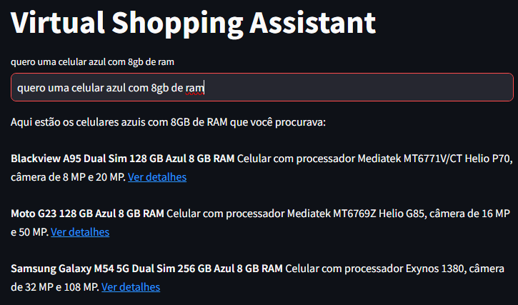

<h1>Projeto Assistente Virtual de Vendas para ECOMMERCE</h1>

O objetivo de projeto é criar um assistente virtual de vendas que é capaz de analisar linguagem natural e retornar o que o usuário deseja

Na primeira versão, o projeto utilaza RAG através de vectorstores, porém para este projeto, utilizar Natural-Language-TO-SQL tornou-se mais viável 

<h3>Tecnologias Utilizadas</h3>
<ul>
<li>Python</li>
<li>Langchain</li>
<li>Streamlit</li>
<li>Groq</li>
<li>LLM:Ollama70b</li>

</ul>
